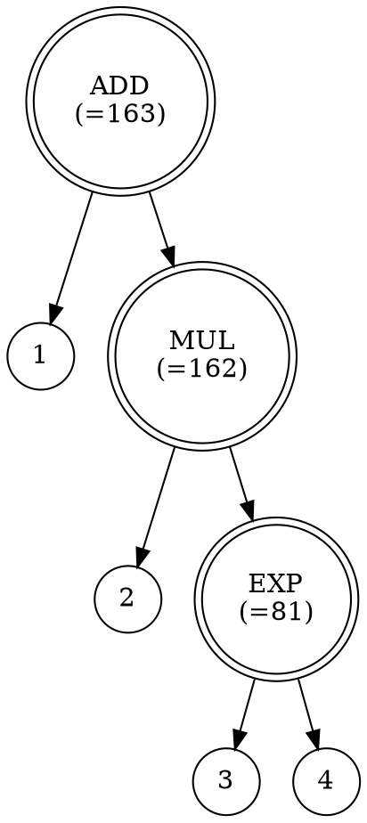

# Arithmetic Expression Compiler

这是一个算术表达式编译器练手项目。

## 功能介绍

支持的运算：
* 正（+）
* 负（-）
* 加（+）
* 减（-）
* 乘（*）
* 除（/）
* 模（%）
* 幂（^）
* 函数
  * 平方根 sqrt(x)
  * 对数 log(a, x)
  * 自然对数 ln(x) = log(e, x)
  * 常用对数（以10为底的对数） lg(x) = log(10, x)
  * 正弦 sin(x)
  * 余弦 cos(x)
  * 正切 tan(x)、tg(x)
  * 余切 cot(x)、ctg(x)

支持的常数写法：
* 整数 123
* 小数 1.23、0.123、.123
* 科学计数法 1e-6、1.23e4、1.24E+4
* 自然对数的底 e
* 圆周率 pi

## 项目结构

* javacc: 基于 Java CC 的语法分析
* antlr3：基于 ANTLR 3 的语法分析
* antlr4：基于 ANTLR 4 的语法分析

## 构建方法

```bash
mvn package
```

然后便可运行各 target 目录下的各个 *-jar-with-dependencies.jar 文件，如
```
java -jar javacc/arithmetic-expression-compiler-java-javacc-1.0-SNAPSHOT-jar-with-dependencies.jar
```
```
java -jar antlr3/arithmetic-expression-compiler-java-antlr3-1.0-SNAPSHOT-jar-with-dependencies.jar
```
```
java -jar antlr4/arithmetic-expression-compiler-java-antlr4-1.0-SNAPSHOT-jar-with-dependencies.jar
```

## 输入输出说明

接受一个算术表达式的输入，输出：
1. 计算结果
2. 文本表示的语法树
3. graphviz 表示的语法树

例如：

输入
```
1+2*3^4
```
输出
```
163
```
```
ADD = 163
  1
  MUL = 162
    2
    EXP = 81
      3
      4
```
